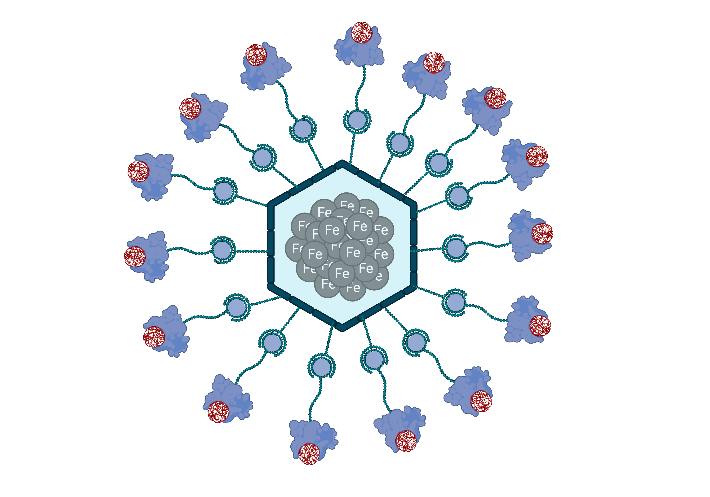

<!-- PROJECT SHIELDS -->
<!--
*** I'm using markdown "reference style" links for readability.
*** Reference links are enclosed in brackets [ ] instead of parentheses ( ).
*** See the bottom of this document for the declaration of the reference variables
*** for contributors-url, forks-url, etc. This is an optional, concise syntax you may use.
*** https://www.markdownguide.org/basic-syntax/#reference-style-links
-->
[![Contributors][contributors-shield]][contributors-url]
[![Size][size-shield]][size-url]
[![Languages][languages-shield]][languages-url]
[![Stargazers][stars-shield]][stars-url]
[![Forks][forks-shield]][forks-url]
[![MIT License][license-shield]][license-url]

  

<!-- LOGO -->
 

  

  <h3 align="center">Hardware and Implementation iGEM.CNPEM</h3>

  

    Welcome to the repository from the iGEM.CNPEM Design League team, focused on the Hardware and Implementation of the B.A.R.B.I.E. project!   
  

<!-- Sumário -->

  
Summary

  <ol>
    <li>
      <a href="#sobre">About the Repository</a>
      <ul>
        <li><a href="#projeto">The Project</a></li>
       </ul>
    </li>
    <li><a href="#progresso">Progress</a></li>
    <li>
      <a href="#isa">About us</a>
      <ul>
        <li><a href="#contato">Contact</a></li>
      </ul>
    </li>
    <li><a href="#acknowledgments">Acknoledgments</a></li>
  </ol>

<!-- Sobre a Disciplina e o Projeto -->
## About the Project 

  > Bioengineered Approach for Removal of microplastics through Bioremediation and Innovative Electromagnetics — or `B.A.R.B.I.E.` — proposes an innovative treatment stage in Water Plants (WTPs).
>  Our approach is implemented after classical filtration with a bio-based process specifically designed to detect and capture Microplastics (MPs) present in the water.

> The ongoing strategy combines magnetic nanoparticles (MNPs) with biological molecules, such as Plastic Binding Proteins (PBP). Thus, the BaCBM2 protein (Bacillus anthraci Carbohydrate Binding Molecule, family 2), which binds to environmentally relevant plastics, moonlights as the key component of B.A.R.B.I.E.

> The proposed strategy includes adding BaCBM2 proteins linked to MNPs, to the treated water. The MNPs, when directed by controlled external magnetic fields, will allow the removal of the nanoparticle-BaCBM2-MP complex.
Concomitantly, we propose the construction of a sensor to detect the presence of MPs in water samples.

>  This sensor uses impedance spectroscopy and machine learning techniques that allow the individual characterization of particles based on their electrical properties, simultaneously identifying the material and size of the particles.

 
  </a>

### The Repository 

In this repository, you will store some codes that our team created and used in order to achieve the iGEM DL. Basicaly, we can separate this repository in two parts: The sensor modeling and the implementation modeling.

#### Sensor notebooks
- linear_fit_sensor: presents a script to make a linear fit in the imaginary part of low-frequency impedance in order to predict the microplastics size [1].
- kNN: Presents a kNN model, proposed in [1], to identify and classify the microplastics based on the impedance measurements.

#### Implementations notebooks
- mps_capture_simulation: presents a hard sphere model to simulate the microplastics capture.
- mps_capture_analysis: analyses the data generated by the capture simulation.
- mps_capture_model: presents a analytical model to study the microplastics capture.
- magnet_simulation: presents a force-field model to simulate the magnetic remotion of microplastics.
- magnet_analysis: analyses the data generated by the remotion simulation.
   
   
<!-- Sobre mim -->
## About us

Who are the students behind this Mathematical Modeling iGEM.CNPEM project? Well, allow us to introduce ourselves:

- 👋 We are Gabriel Pereira, Isabela Beneti and Pedro Zaninelli
- 📕 We are students from the The Brazilian Center for Research in Energy and Materials (CNPEM)
- 👨‍🔬 CNPEM hosts 4 national laboratories, including SIRIUS (Brazilian particle accelerator) and LNBR (Brazilian National Laboratory for BioRenewables).
- 💖 CNPEM has its own Design League team, iGEM.CNPEM, which this year created the B.A.R.B.I.E. project
- 👩‍💻 This repository aims to store all the data and code developed in the mathematical modeling branch of the iGEM.CNPEM team.

<!-- CONTATO -->
### Contacts 
 

  
  
   
  
 

<!-- ACKNOWLEDGMENTS -->
## Acknoledgments 
Without the help of our mentors, we wouldn't have been able to reach where we are now! Therefore, we thank the following individuals who contributed to this project:

<table>
  <tr>
    <td align="center">
      <a href="#">
         
        
          <b>Vinícius Wasques (Professor)</b>
        
      </a>
    </td>
    <td align="center">
      <a href="#">
         
        
          <b>João Eduardo Levandoski (Mentor)</b>
        
      </a>
    </td>
    <td align="center">
      <a href="#">
         
        
          <b>Alessandro Mourato (Técnico)</b>
        
      </a>
    </td>
  </tr>
</table>

 
 

<!-- MARKDOWN LINKS & IMAGES -->
<!-- https://www.markdownguide.org/basic-syntax/#reference-style-links -->
[contributors-shield]: https://img.shields.io/github/contributors/benetao/Mathematical_Modeling_iGEM.CNPEM.svg?style=for-the-badge
[contributors-url]: https://github.com/benetao/Mathematical_Modeling_iGEM.CNPEM/graphs/contributors
[forks-shield]: https://img.shields.io/github/forks/benetao/Mathematical_Modeling_iGEM.CNPEM.svg?style=for-the-badge
[forks-url]: https://github.com/benetao/Mathematical_Modeling_iGEM.CNPEM/network/members
[stars-shield]: https://img.shields.io/github/stars/benetao/Mathematical_Modeling_iGEM.CNPEM.svg?style=for-the-badge
[stars-url]: https://github.com/benetao/Mathematical_Modeling_iGEM.CNPEM/stargazers
[issues-shield]: https://img.shields.io/github/issues/benetao/Mathematical_Modeling_iGEM.CNPEM.svg?style=for-the-badge
[issues-url]: https://github.com/benetao/Mathematical_Modeling_iGEM.CNPEM/issues
[license-shield]: https://img.shields.io/github/license/benetao/Mathematical_Modeling_iGEM.CNPEM.svg?style=for-the-badge
[license-url]: https://github.com/benetao/Mathematical_Modeling_iGEM.CNPEM/blob/master/LICENSE.txt
[size-shield]: https://img.shields.io/github/repo-size/benetao/Mathematical_Modeling_iGEM.CNPEM.svg?style=for-the-badge
[size-url]: https://github.com/benetao/Mathematical_Modeling_iGEM.CNPEM/repo-size
[languages-shield]: https://img.shields.io/github/languages/count/benetao/Mathematical_Modeling_iGEM.CNPEM.svg?style=for-the-badge
[languages-url]: https://github.com/benetao/Mathematical_Modeling_iGEM.CNPEM//languages/count

[linkedin-shield]: https://img.shields.io/badge/-LinkedIn-black.svg?style=for-the-badge&logo=linkedin&colorB=555
[linkedin-url]: https://www.linkedin.com/in/isabela-bento-beneti-044183236/
[product-screenshot]: images/screenshot.png
[Next.js]:  
[Next-url]: https://nextjs.org/
[React.js]: https://img.shields.io/badge/React-20232A?style=for-the-badge&logo=react&logoColor=61DAFB
[React-url]: https://reactjs.org/
[Vue.js]: https://img.shields.io/badge/Vue.js-35495E?style=for-the-badge&logo=vuedotjs&logoColor=4FC08D
[Vue-url]: https://vuejs.org/
[Angular.io]: https://img.shields.io/badge/Angular-DD0031?style=for-the-badge&logo=angular&logoColor=white
[Angular-url]: https://angular.io/
[Svelte.dev]: https://img.shields.io/badge/Svelte-4A4A55?style=for-the-badge&logo=svelte&logoColor=FF3E00
[Svelte-url]: https://svelte.dev/
[Laravel.com]: https://img.shields.io/badge/Laravel-FF2D20?style=for-the-badge&logo=laravel&logoColor=white
[Laravel-url]: https://laravel.com
[Bootstrap.com]: https://img.shields.io/badge/Bootstrap-563D7C?style=for-the-badge&logo=bootstrap&logoColor=white
[Bootstrap-url]: https://getbootstrap.com
[JQuery.com]: https://img.shields.io/badge/jQuery-0769AD?style=for-the-badge&logo=jquery&logoColor=white
[JQuery-url]: https://jquery.com 
[ilum-shield]:"https://user-images.githubusercontent.com/106626661/193426698-dea48fae-20be-423c-8680-41c50c6aa247.png"
